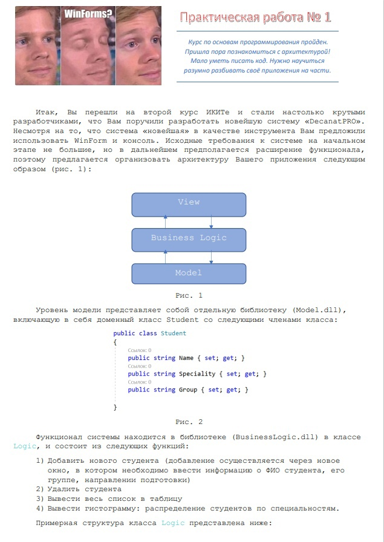
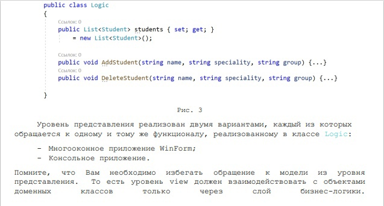
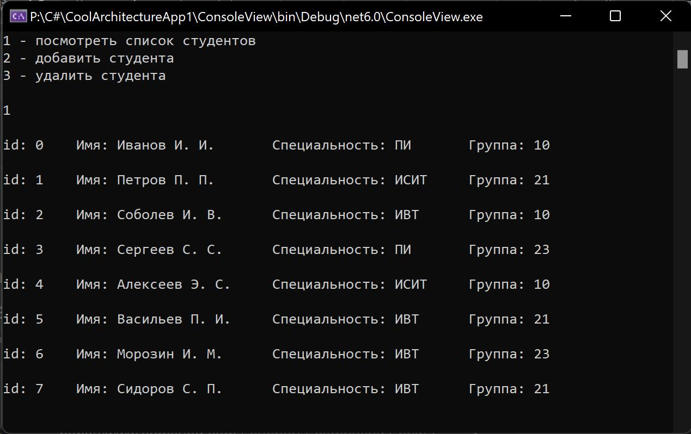
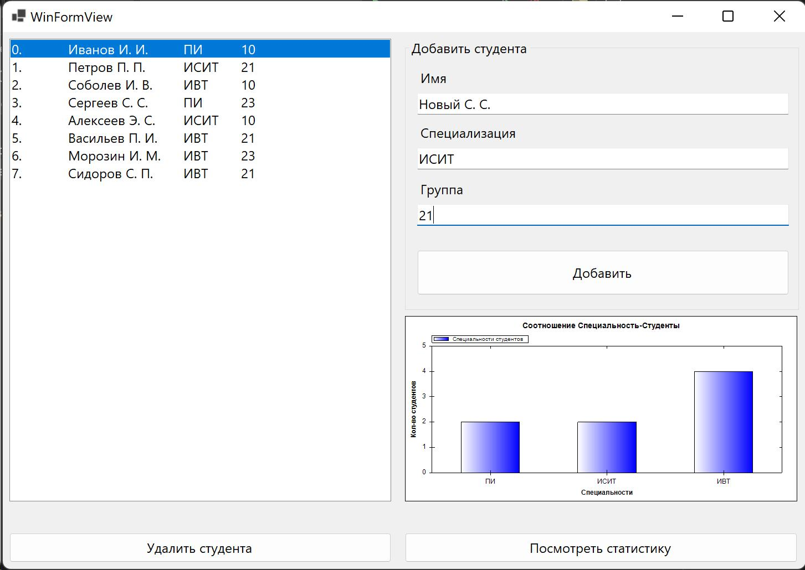
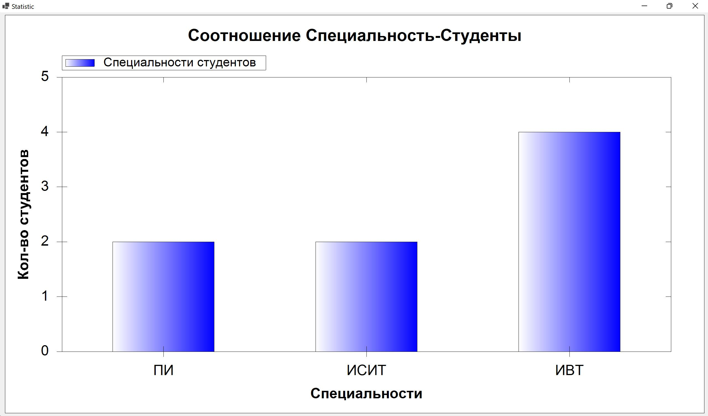

# Лабораторные работы 3 семестр

C#. Архитектура. Паттерны. Лабы.

## Лабораторная № 1

+ MWP паттерн,  
+ dll-библиотека **моделей**,  
+ dll-библиотека **бизнес логики**,  
+ **Views:**  
  - **Консоль**ное представление,
  - **Windows Forms** (почему? нас обязали использовать древние технологии)

### Реализация:

Консольное представление **(Console View)**

**Windows Forms View**

При нажатии кнопки **посмотреть статистику** всплывает окно со статистикой

---
